Jobsheet4

Praktikum 1: Eksperimen Tipe Data List
Langkah 1:

Ketik atau salin kode program berikut ke dalam void main().
var list = [1, 2, 3];
assert(list.length == 3);
assert(list[1] == 2);
print(list.length);
print(list[1]);

list[1] = 1;
assert(list[1] == 1);
print(list[1]);

Langkah 2:
Silakan coba eksekusi (Run) kode pada langkah 1 tersebut. Apa yang terjadi? Jelaskan!
Hasil:
Yang terjadi saat kode tersebut dijalankan adalah:

1. List dideklarasikan: list dibuat dengan nilai [1, 2, 3].

Pengecekan menggunakan assert:

- assert(list.length == 3); akan memeriksa apakah panjang list adalah 3. Jika benar, kode berjalan normal. Jika salah, aplikasi akan berhenti dan menampilkan error.
- assert(list[1] == 2); memeriksa apakah elemen pada indeks 1 adalah 2. Jika benar, aplikasi berjalan lanjut, jika salah, aplikasi akan berhenti.
- Output pertama: print(list.length); mencetak panjang list, yaitu 3.

2. Output kedua: print(list[1]); mencetak nilai elemen pada indeks 1, yaitu 2.

3. Nilai elemen berubah: list[1] = 1; mengubah nilai elemen pada indeks 1 menjadi 1.

4. Pengecekan assert lagi:

- assert(list[1] == 1); memastikan bahwa nilai pada indeks 1 sudah berubah menjadi 1. Jika benar, kode lanjut, jika tidak, aplikasi berhenti.
- Output ketiga: print(list[1]); mencetak nilai elemen yang telah diubah pada indeks 1, yaitu 1.

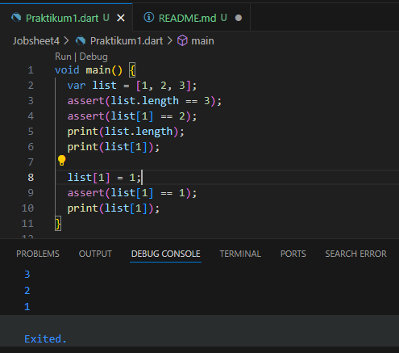 

Langkah 3:

Ubah kode pada langkah 1 menjadi variabel final yang mempunyai index = 5 dengan default value = null. Isilah nama dan NIM Anda pada elemen index ke-1 dan ke-2. Lalu print dan capture hasilnya.

Apa yang terjadi ? Jika terjadi error, silakan perbaiki.
Hasil:

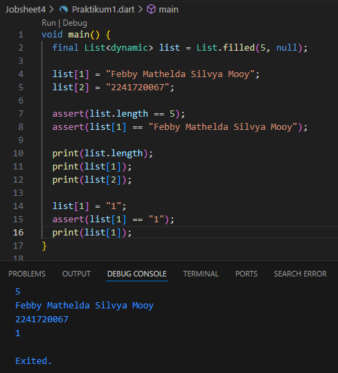 

- List.filled(5, null) digunakan untuk membuat sebuah list dengan panjang 5 dan nilai default null.
- list[1] = "Febby Mathelda Silvya Mooy" dan list[2] = "2241720067" digunakan untuk mengisi nama dan NIM pada index ke-1 dan ke-2.
- Pada bagian list[1] = 1, kode berhasil mengganti nilai pada index ke-1 tanpa masalah karena list bersifat dinamis dan dapat menyimpan tipe data apa pun.

Praktikum 2: Eksperimen Tipe Data Set

Langkah 1:
Ketik atau salin kode program berikut ke dalam fungsi main().

var halogens = {'fluorine', 'chlorine', 'bromine', 'iodine', 'astatine'};
print(halogens);

Langkah 2:
Silakan coba eksekusi (Run) kode pada langkah 1 tersebut. Apa yang terjadi? Jelaskan! Lalu perbaiki jika terjadi error.

Hasil:

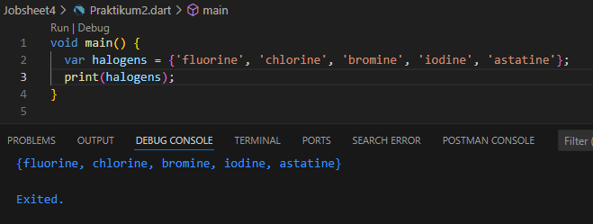 

Ketika Program akan mencetak isi dari set halogens, yaitu sekumpulan unsur halogen yang telah dideklarasikan. Karena set adalah struktur data yang tidak berurut dan tidak mengizinkan duplikasi, elemen-elemen tersebut akan ditampilkan tanpa urutan khusus.

Langkah 3:
Tambahkan kode program berikut, lalu coba eksekusi (Run) kode Anda.

var names1 = <String>{};
Set<String> names2 = {}; // This works, too.
var names3 = {}; // Creates a map, not a set.

print(names1);
print(names2);
print(names3);

Apa yang terjadi ? Jika terjadi error, silakan perbaiki namun tetap menggunakan ketiga variabel tersebut. Tambahkan elemen nama dan NIM Anda pada kedua variabel Set tersebut dengan dua fungsi berbeda yaitu .add() dan .addAll(). Untuk variabel Map dihapus, nanti kita coba di praktikum selanjutnya.

Hasil:

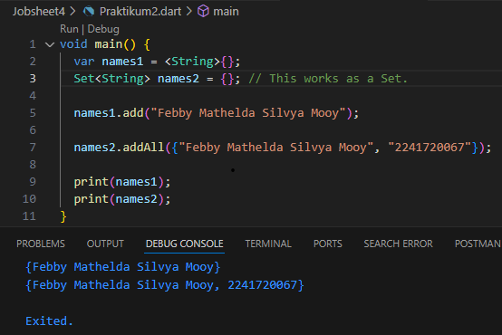 

- names1.add("Febby Mathelda Silvya Mooy"): Menambahkan satu elemen ke dalam set names1.
- names2.addAll({"Febby Mathelda Silvya Mooy", "2241720067"}): Menambahkan beberapa elemen sekaligus ke dalam set names2 menggunakan fungsi .addAll().

Praktikum 3: Eksperimen Tipe Data Maps

Langkah 1:
Ketik atau salin kode program berikut ke dalam fungsi main().

var gifts = {
  // Key:    Value
  'first': 'partridge',
  'second': 'turtledoves',
  'fifth': 1
};

var nobleGases = {
  2: 'helium',
  10: 'neon',
  18: 2,
};

print(gifts);
print(nobleGases);

Langkah 2:
Silakan coba eksekusi (Run) kode pada langkah 1 tersebut. Apa yang terjadi? Jelaskan! Lalu perbaiki jika terjadi error.
Hasil:

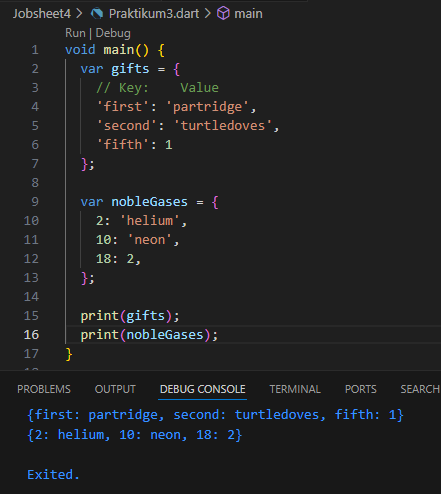 

outpunya akan menghasilkan {first: partridge, second: turtledoves, fifth: 1}
{2: helium, 10: neon, 18: 2}

Langkah 3:
Tambahkan kode program berikut, lalu coba eksekusi (Run) kode Anda.

var mhs1 = Map<String, String>();
gifts['first'] = 'partridge';
gifts['second'] = 'turtledoves';
gifts['fifth'] = 'golden rings';

var mhs2 = Map<int, String>();
nobleGases[2] = 'helium';
nobleGases[10] = 'neon';
nobleGases[18] = 'argon';
Apa yang terjadi ? Jika terjadi error, silakan perbaiki.

Tambahkan elemen nama dan NIM Anda pada tiap variabel di atas (gifts, nobleGases, mhs1, dan mhs2). Dokumentasikan hasilnya dan buat laporannya!
Hasul:

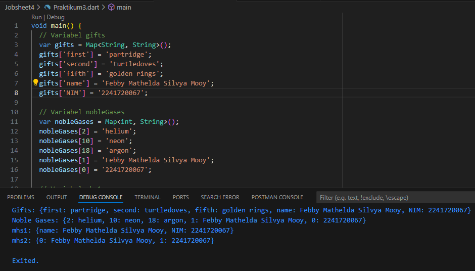 

Praktikum 4: Eksperimen Tipe Data List: Spread dan Control-flow Operators

Langkah 1:
Ketik atau salin kode program berikut ke dalam fungsi main().

var list = [1, 2, 3];
var list2 = [0, ...list];
print(list1);
print(list2);
print(list2.length);

Langkah 2:
Silakan coba eksekusi (Run) kode pada langkah 1 tersebut. Apa yang terjadi? Jelaskan! Lalu perbaiki jika terjadi error.
Hasil:

Kode ini menghasilkan output error karena variabel list1 tidak didefinisikan. Seharusnya yang di-print adalah list. Spread operator (...list) pada list2 berfungsi untuk menggabungkan elemen dari list sehingga list2 berisi [0, 1, 2, 3]. Panjang list2 adalah 4.

code setelah diperbaiki:

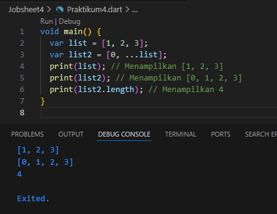 

Langkah 3:
Tambahkan kode program berikut, lalu coba eksekusi (Run) kode Anda.

list1 = [1, 2, null];
print(list1);
var list3 = [0, ...?list1];
print(list3.length);
Apa yang terjadi ? Jika terjadi error, silakan perbaiki.

Tambahkan variabel list berisi NIM Anda menggunakan Spread Operators. Dokumentasikan hasilnya dan buat laporannya!
Hasil:
sebelum perbaikan Kode tersebut error karena variabel list1 tidak dideklarasikan dengan benar. Dalam Dart, variabel harus selalu didefinisikan dengan tipe atau menggunakan var sebelum digunakan.

setelah perbaikkan code:

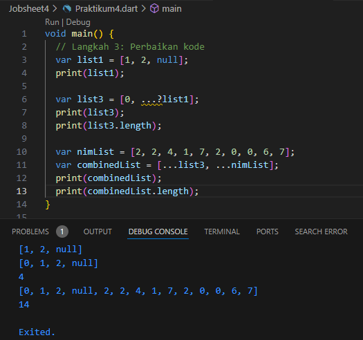 

Langkah 4:
Tambahkan kode program berikut, lalu coba eksekusi (Run) kode Anda.

var nav = ['Home', 'Furniture', 'Plants', if (promoActive) 'Outlet'];
print(nav);
Apa yang terjadi ? Jika terjadi error, silakan perbaiki. Tunjukkan hasilnya jika variabel promoActive ketika true dan false.
Hasil:

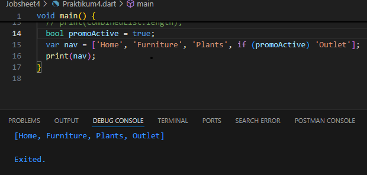 

Jika Codenya berisi "true" maka akan menghasilkan [Home, Furniture, Plants, Outlet]

jika  promoActive bernilai false, hasil yang dicetak adalah [Home, Furniture, Plants]

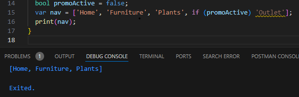 

Langkah 5:
Tambahkan kode program berikut, lalu coba eksekusi (Run) kode Anda.

var nav2 = ['Home', 'Furniture', 'Plants', if (login case 'Manager') 'Inventory'];
print(nav2);
Apa yang terjadi ? Jika terjadi error, silakan perbaiki. Tunjukkan hasilnya jika variabel login mempunyai kondisi lain.
Hasil:

Kode program yang tersebut mengalami error karena syntax if (login case 'Manager') tidak sesuai dengan aturan penulisan Dart. Penulisan yang benar adalah dengan menggunakan operator logika biasa, seperti == untuk pengecekan kondisi. Selain itu, variabel login perlu didefinisikan terlebih dahulu.

Hasil perbaikkan code:
Jika variabel login bernilai 'Manager', hasilnya akan menjadi:

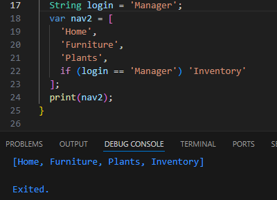 

Jika variabel login bernilai selain 'Manager' maka hasilnya akan menjadi:

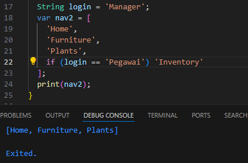 

Perbedaannya adalah item 'Inventory' hanya ditambahkan ke dalam list nav2 jika kondisi login == 'Manager' terpenuhi.

Langkah 6:
Tambahkan kode program berikut, lalu coba eksekusi (Run) kode Anda.

var listOfInts = [1, 2, 3];
var listOfStrings = ['#0', for (var i in listOfInts) '#$i'];
assert(listOfStrings[1] == '#1');
print(listOfStrings);
Apa yang terjadi ? Jika terjadi error, silakan perbaiki. Jelaskan manfaat Collection For dan dokumentasikan hasilnya.
Hasil:

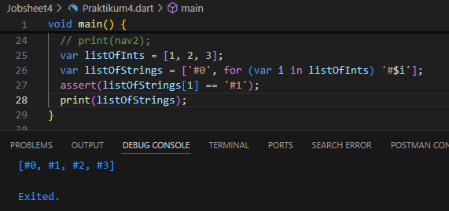 

Collection For digunakan untuk membuat elemen-elemen dalam koleksi (list, set, dll.) secara dinamis berdasarkan nilai-nilai dari koleksi lain.

Pada kode di atas, kita memiliki listOfInts yang berisi [1, 2, 3]. Kemudian, listOfStrings diinisialisasi dengan elemen pertama sebagai '#0', dan sisanya dihasilkan menggunakan for loop pada listOfInts.

for (var i in listOfInts) '#$i' akan menghasilkan string '#1', '#2', dan '#3' yang kemudian ditambahkan ke listOfStrings.

Praktikum 5: Eksperimen Tipe Data Records

Langkah 1:
Ketik atau salin kode program berikut ke dalam fungsi main().

var record = ('first', a: 2, b: true, 'last');
print(record)

Langkah 2:
Silakan coba eksekusi (Run) kode pada langkah 1 tersebut. Apa yang terjadi? Jelaskan! Lalu perbaiki jika terjadi error.
Hasil:
Akan menghasilkan output

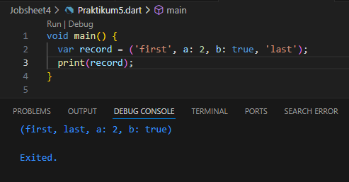 

Langkah 3:
Tambahkan kode program berikut di luar scope void main(), lalu coba eksekusi (Run) kode Anda.

(int, int) tukar((int, int) record) {
  var (a, b) = record;
  return (b, a);
}
Apa yang terjadi ? Jika terjadi error, silakan perbaiki. Gunakan fungsi tukar() di dalam main() sehingga tampak jelas proses pertukaran value field di dalam Records.
Hasil:

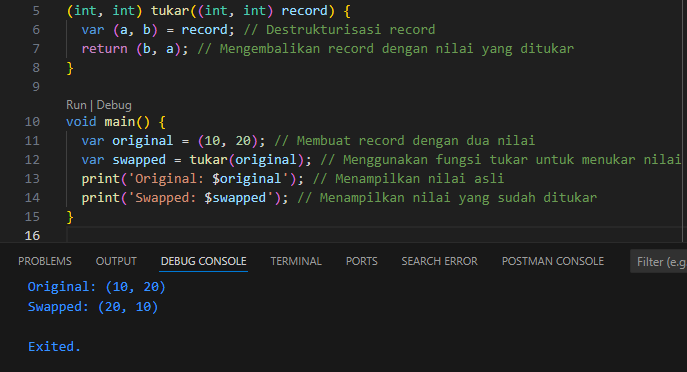 

Records: Fitur ini memungkinkan penyimpanan beberapa nilai dalam satu unit tanpa memerlukan class atau struct.

Destrukturisasi: Dalam fungsi tukar(), var (a, b) = record mengambil dua nilai dari record (int, int) dan menyimpannya di variabel a dan b.

Fungsi tukar(): Fungsi ini mengembalikan record baru yang berisi nilai b dan a, yaitu nilai yang ditukar.

Penggunaan dalam main(): Record original disimpan sebagai (10, 20), kemudian dipanggil fungsi tukar() untuk menukarnya menjadi (20, 10).

Langkah 4:
Tambahkan kode program berikut di dalam scope void main(), lalu coba eksekusi (Run) kode Anda.

// Record type annotation in a variable declaration:
(String, int) mahasiswa;
print(mahasiswa);
Apa yang terjadi ? Jika terjadi error, silakan perbaiki. Inisialisasi field nama dan NIM Anda pada variabel record mahasiswa di atas. Dokumentasikan hasilnya dan buat laporannya!
Hasil:

Terjadi error karena variabel mahasiswa dideklarasikan tanpa inisialisasi

Code setelah diperbaiki:

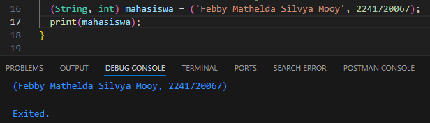 

Record (String, int) Ini menunjukkan bahwa mahasiswa adalah record yang terdiri dari dua field, yaitu string (untuk nama) dan integer (untuk NIM).

Langkah 5:
Tambahkan kode program berikut di dalam scope void main(), lalu coba eksekusi (Run) kode Anda.

var mahasiswa2 = ('first', a: 2, b: true, 'last');

print(mahasiswa2.$1); // Prints 'first'
print(mahasiswa2.a); // Prints 2
print(mahasiswa2.b); // Prints true
print(mahasiswa2.$2); // Prints 'last'
Apa yang terjadi ? Jika terjadi error, silakan perbaiki. Gantilah salah satu isi record dengan nama dan NIM Anda, lalu dokumentasikan hasilnya dan buat laporannya!

Hasil:

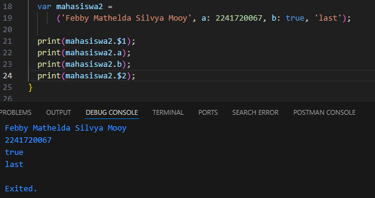 

kode program ini menggunakan Record dengan field posisional dan field bernama untuk menyimpan data. Salah satu field posisional berisi nama lengkap, dan field a berisi NIM. Program berhasil dijalankan tanpa error dan mencetak nilai-nilai dari field Record sesuai dengan urutannya.

Tugas Praktikum:
1. Silakan selesaikan Praktikum 1 sampai 5, lalu dokumentasikan berupa screenshot hasil pekerjaan Anda beserta penjelasannya!
2. Jelaskan yang dimaksud Functions dalam bahasa Dart!
Jawab:

Functions dalam Dart adalah blok kode yang dapat digunakan kembali untuk menjalankan tugas tertentu. Dart mendukung berbagai jenis function, termasuk function dengan parameter dan function yang mengembalikan nilai.

3. Jelaskan jenis-jenis parameter di Functions beserta contoh sintaksnya!
Jawab:

Jenis-jenis parameter
- Positional Parameters: Parameter ini diisi berdasarkan urutan saat fungsi dipanggil.
"void greet(String name) {
  print('Hello, $name');
}
greet('Febby'); // Hello, Febby"

- Optional Positional Parameters: Parameter yang opsional dan diletakkan dalam kurung kotak [].
- Named Parameters: Parameter yang diberi nama saat memanggil fungsi, dan bisa bersifat opsional dengan tanda {}.
- Default Parameters: Nilai default bisa diberikan pada named atau optional parameters.

4. Jelaskan maksud Functions sebagai first-class objects beserta contoh sintaknya!
Jawab:
functions adalah first-class objects, artinya mereka bisa disimpan dalam variabel, dikirim sebagai parameter ke fungsi lain, dan dikembalikan oleh fungsi lain.
Contoh sintaksnya adalah sebagai berikut:
void printMessage(String message) {
  print(message);
}

void runFunction(Function func, String value) {
  func(value);
}

void main() {
  var myFunction = printMessage; // Function disimpan dalam variabel
  runFunction(myFunction, 'Hello, Febby!'); // Function dikirim sebagai argumen
}

5. Apa itu Anonymous Functions? Jelaskan dan berikan contohnya!
Jawab:
Anonymous functions adalah fungsi tanpa nama yang sering digunakan sebagai argumen fungsi lain atau untuk tugas sekali pakai.
Contoh:
void main() {
  var list = ['Febby', 'Silvya', 'Mooy'];

  // Menggunakan anonymous function dalam fungsi forEach
  list.forEach((name) {
    print('Hello, $name');
  });
}
(name) { print('Hello, $name'); } adalah anonymous function.

6. Jelaskan perbedaan Lexical scope dan Lexical closures! Berikan contohnya!
Jawab:
Lexical Scope: Variabel dalam Dart hanya dapat diakses dari fungsi atau blok kode di mana variabel itu dideklarasikan. Ini disebut sebagai scoping.
Contoh:
void main() {
  int number = 42; // Variabel number berada di dalam lingkup (scope) fungsi main
  void printNumber() {
    print(number); // Variabel number dapat diakses di sini
  }
  printNumber(); // 42
}

Lexical Closure: Closure adalah fungsi yang dapat "menutup" lingkup di sekitarnya, sehingga tetap dapat mengakses variabel dari lingkup yang dideklarasikan meskipun di luar fungsi tersebut.

Contoh:
Function makeMultiplier(num factor) {
  return (num i) => factor * i;
}

void main() {
  var triple = makeMultiplier(3); // triple "menyimpan" lingkup factor = 3
  print(triple(6)); // 18
}

7. Jelaskan dengan contoh cara membuat return multiple value di Functions!
Jawab:
Contoh menggunakan record:
(String, int) getStudentData() {
  String name = 'Febby';
  int nim = 2241720067;
  return (name, nim); 
}

void main() {
  var (name, nim) = getStudentData();
  print('Name: $name, NIM: $nim');
}
Contoh menggunakan List:
List<dynamic> getStudentData() {
  String name = 'Febby';
  int nim = 2241720067;
  return [name, nim];
}

void main() {
  var studentData = getStudentData();
  print('Name: ${studentData[0]}, NIM: ${studentData[1]}');
}

8. Kumpulkan berupa link commit repo GitHub pada tautan yang telah disediakan di grup Telegram!

