# Pemrograman_Mobile
Pemrograman Mobile Semester 5

Langkah 1:
Ketik atau salin kode program berikut ke dalam fungsi main().
Hasil:
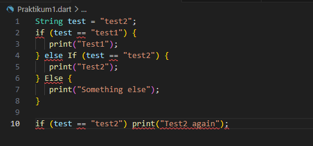 

Langkah 2:
Silakan coba eksekusi (Run) kode pada langkah 1 tersebut. Apa yang terjadi? Jelaskan!
Hasil:
Setelah dirun terjadi error pada penggunaan else If dan Else (dengan huruf besar) yang seharusnya ditulis sebagai else if dan else (dengan huruf kecil) Dalam Dart, kata kunci if, else dan else if harus ditulis dalam huruf kecil karena bersifat case-sensitive.
Berikut gambar setelah code tersebut diperbaiki:
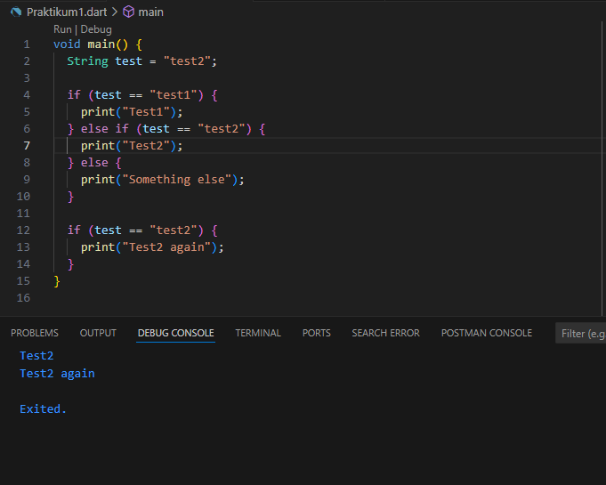 

Langkah 3:
Tambahkan kode program berikut, lalu coba eksekusi (Run) kode Anda.

String test = "true";
if (test) {
   print("Kebenaran");
}
Apa yang terjadi ? Jika terjadi error, silakan perbaiki namun tetap menggunakan if/else.
Hasil:
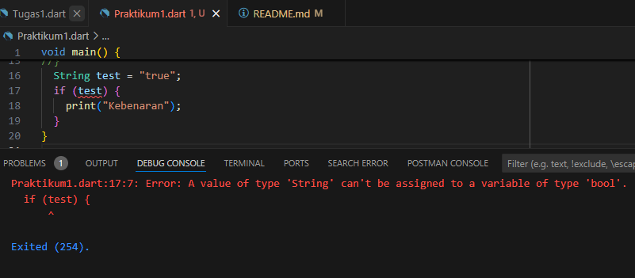 

Dalam kondisi if menggunakan sebuah string yang merupakan sebuah pernyataan yang salah, karena Dart tidak dapat mengonversi string ke boolean.
Setelah codenya "string" diubah menjadi "boolean"
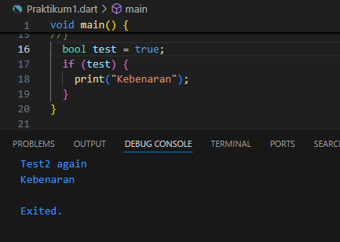 

Outputnya tidak error lagi

Praktikum 2 - Menerapkan Perulangan "while" dan "do-while"
Langkah 1
Ketik atau salin kode program berikut ke dalam fungsi main().
while (counter < 33) {
  print(counter);
  counter++;
}
Langkah 2:
Silakan coba eksekusi (Run) kode pada langkah 1 tersebut. Apa yang terjadi? Jelaskan! Lalu perbaiki jika terjadi error.
Hasil:
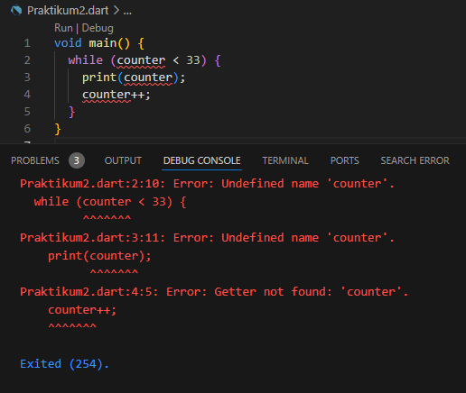 

Terjadi error pada code tersebut variabel counter tidak dideklarasikan atau diinisialisasi sebelum digunakan
Setelah code diperbaiki:
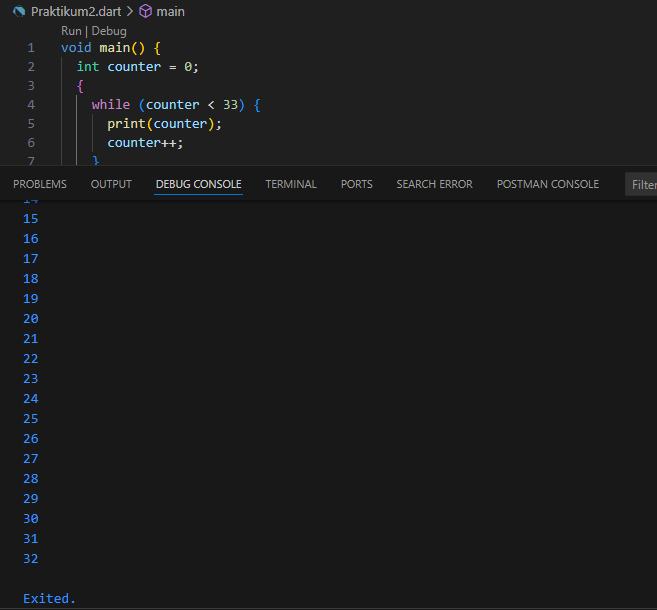 

Langkah 3:
Tambahkan kode program berikut, lalu coba eksekusi (Run) kode Anda.

do {
  print(counter);
  counter++;
} while (counter < 77);
Apa yang terjadi ? Jika terjadi error, silakan perbaiki namun tetap menggunakan do-while.
Hasil:
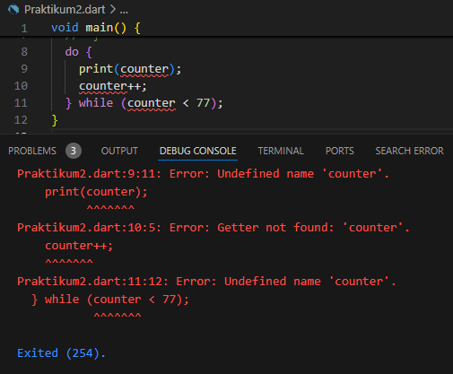 

Pada code ini kita perlu mendeklarasikan dan menginisialisasi variabel counter sebelum menggunakannya
Setelah code diperbaiki:
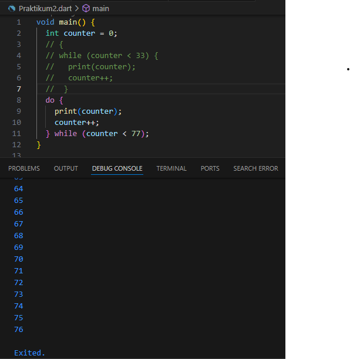 

Setelah menambahkan inisialisasi variabel counter maka code tersebut tidak error lagi. dan hasilnya akan mencetak angka dari 0 hingga 76 ke layar console.

Praktikum 3: Menerapkan Perulangan "for" dan "break-continue"
Langkah 1:
Ketik atau salin kode program berikut ke dalam fungsi main().

for (Index = 10; index < 27; index) {
  print(Index);
}
Langkah 2:
Silakan coba eksekusi (Run) kode pada langkah 1 tersebut. Apa yang terjadi? Jelaskan! Lalu perbaiki jika terjadi error.
Hasil:
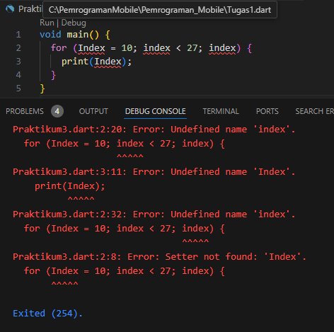 

Terjadi error karena 
-Variabel Index tidak dideklarasikan atau diinisialisasi sebelum digunakan.
-For tidak dapat melakukan peningkatan nilai variabel Index. 
Setelah code diperbaiki:
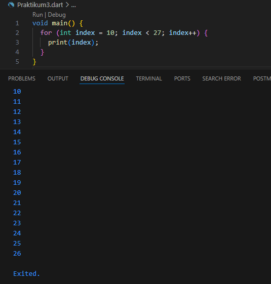 

Langkah 3:
Tambahkan kode program berikut di dalam for-loop, lalu coba eksekusi (Run) kode Anda.
If (Index == 21) break;
Else If (index > 1 || index < 7) continue;
print(index);
Apa yang terjadi ? Jika terjadi error, silakan perbaiki namun tetap menggunakan for dan break-continue.
Hasil:
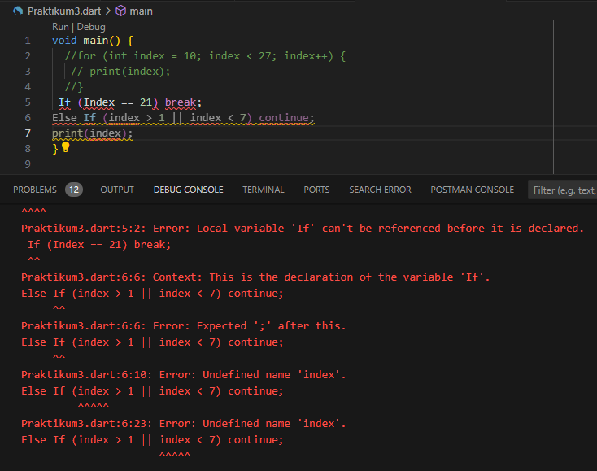 

Error karena terdapat Kesalahan pada penulisan kata "if" dan "else if" yang harus diawali dengan huruf kecil (if dan else if), karena bersifat case-sensitive lalu variabel index harus dideklarasikan dan diinisialisasi sebelum digunakan dalam kondisi.
Setelah code diperbaiki:
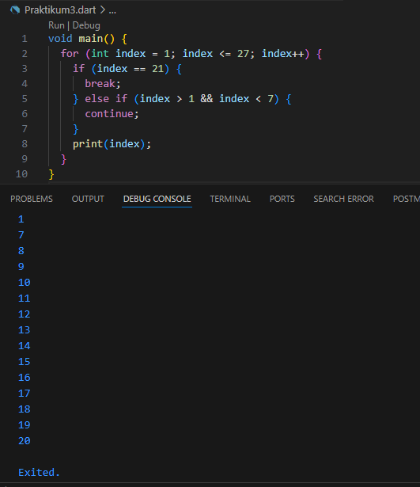 

Tugas Praktikum
1. Silakan selesaikan Praktikum 1 sampai 3, lalu dokumentasikan berupa screenshot hasil pekerjaan beserta penjelasannya!
2. Buatlah sebuah program yang dapat menampilkan bilangan prima dari angka 0 sampai 201 menggunakan Dart. Ketika bilangan prima ditemukan, maka tampilkan nama lengkap dan NIM Anda.
Hasil code program:
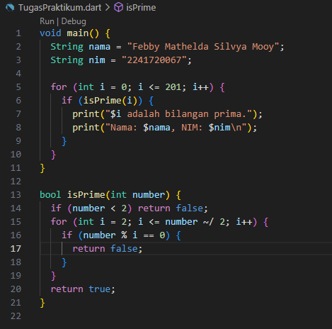 

Hasil Run:
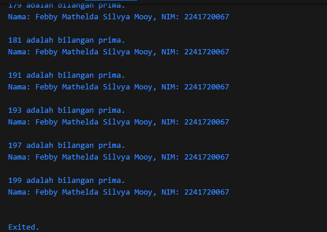 

3. Kumpulkan berupa link commit repo GitHub pada tautan yang telah disediakan di grup Telegram!

